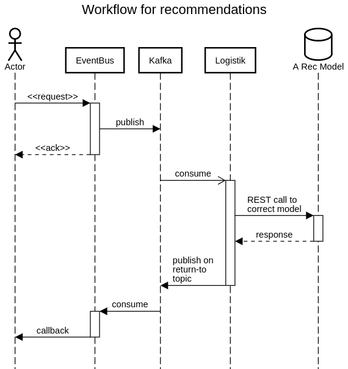
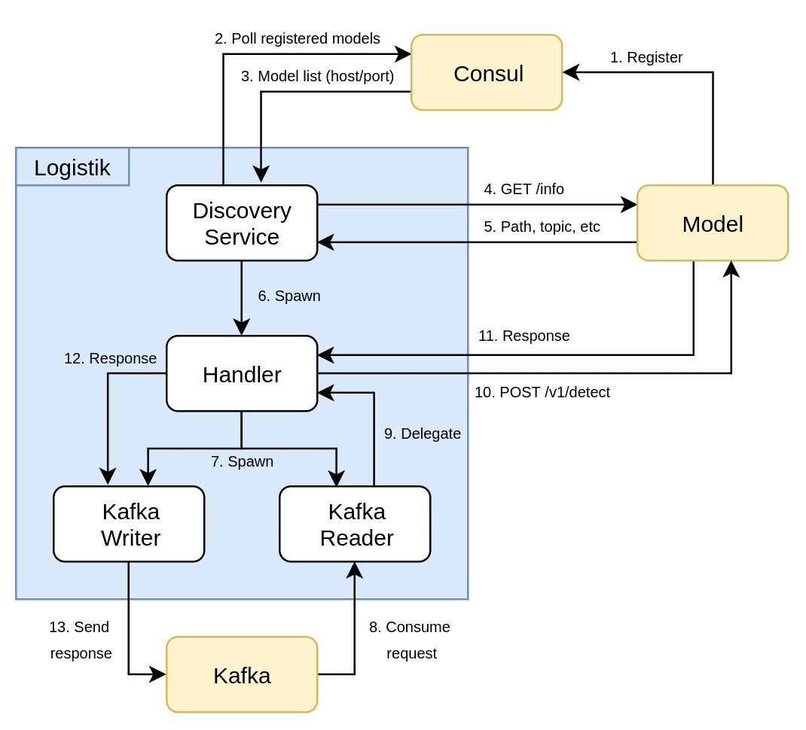

# Machine Learning Model Logistics

[](https://requires.io/github/thenetcircle/logistik/requirements/?branch=master)
[](https://travis-ci.org/thenetcircle/logistik)
[](https://codecov.io/gh/thenetcircle/logistik)
[](https://codeclimate.com/github/thenetcircle/logistik)
[](LICENSE)

"90% of the effort in successful machine learning is not about the algorithm or the model or the learning. It’s about logistics."





## Starting the consul agent

```bash
sudo consul agent -config-file /etc/consul.d/config.json
```

## Starting logistik

```bash
LK_ENVIRONMENT=default gunicorn \
  --workers 1 \
  --threads 1 \
  --worker-class eventlet \
  --bind 0.0.0.0:5656 app:app
```

## Starting a model

```bash
#!/bin/bash
ianitor -v \
  --id $(uuidgen | cut -c 1-8) \  # needs to be unique, not used by logistik
  --address 10.60.1.125 \  # address to this node
  --consul-agent=10.60.1.124 \  # which consul agent to connect to
  --tags logistik \  # this is needed for logistik to not ignore your service in consul
  --tags model=model \  # usually one of ['model', 'canary', 'deploy']
  --tags node=3 \  # the instance number for this model on this host, if you run more than one
  --tags hostname=mk2 \  # human-readable identifier for this host
  --tags version=$(git describe) \  # usually the version of your model, using the git tag here
  --port 5052 \
  the_service_name -- \  # you should name your service here, likely the name of your model
gunicorn \  # this is whatever command is used to start your model, here we're using gunicorn
  --worker-class eventlet \
  --workers 1 \
  --threads 1 \
  --worker-connections 500 \
  --timeout 180 \
  --bind 0.0.0.0:5053 \
  app:app
```
